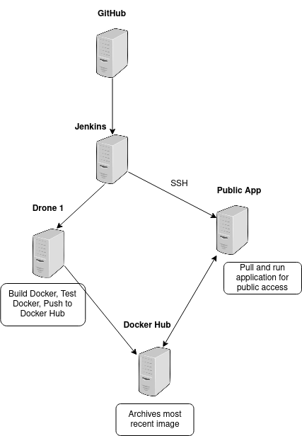

# CCMS Project 2

`CI/CD Pipeline` for a `Python (Flask)` web app.

- Stored in a `Docker Hub` & `Github` Repository,
- Running on a `Docker (Kubernetes)` Network,
- Hosted by an `AWS EC2 Instance` Integrated through `Jenkins`.



## Continuous Integration

- `GitHub webhook` notifies `Jenkins` of a `push` to `main`.
- `Jenkins` then spins up an `EC2 instance` for `testing` and `building`.
- If `unittests` pass, `docker image` is pushed to `Docker Hub`.

## Continuous Deployment

After a successful push to `Docker Hub`, `Jenkins` uses `SSH` to `pull` and `run the latest image`.

## Local Development

### Setup & Run:

```bash
docker build -t ccms-project2-image

docker run -p 5000:5000 --rm --name ccms-project2-container ccms-project2-image

or

export FLASK_APP=app.py
export FLASK_ENV=development
flask run
```

<http://127.0.0.1:5000>

### K8s on EKS: kubectl apply -f .yaml
1. kubectl apply -f nginx-ingress-controller.yaml
2. kubectl apply -f flask-deployment.yaml
3. kubectl apply -f flask-service.yaml
4. kubectl apply -f nginx-ingress.yaml
5. verify:
   1. nginx-ingress: kubectl get svc --namespace=nginx-ingress
   2. stable: curl -i -H "Host: flask.app.com" nginx-ingress-external-ip
   3. stable: curl -i -H "Host: flaskstage.app.com" nginx-ingress-external-ip
6. update flask-app-svc-stable version to GREEN
7. verify backgroun of stable via:
   1. curl -i -H "Host: flask.app.com" nginx-ingress-external-ip