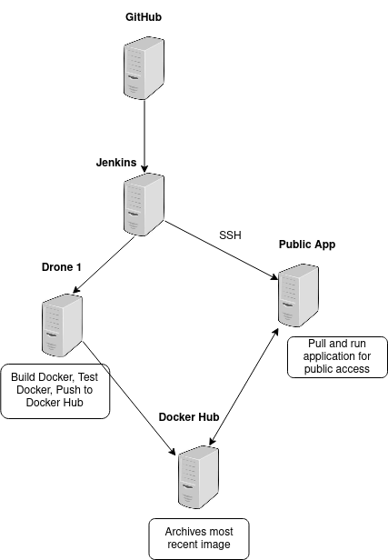

# CCMS Project 2

`CI/CD Pipeline` for a `Python (Flask)` web app.

- Stored in a `Docker Hub` & `Github` Repository,
- Running on a `Docker (Kubernetes)` Network,
- Hosted by an `AWS EC2 Instance` Integrated through `Jenkins`.



## Continuous Integration

- `GitHub webhook` notifies `Jenkins` of a `push` to `main`.
- `Jenkins` then spins up an `EC2 instance` for `testing` and `building`.
- If `unittests` pass, `dcoker image` is pushed to `Docker Hub`.

## Continuous Deployment

After a successful push to `Docker Hub`, `Jenkins` uses `SSH` to `pull` and `run the latest image` from Docker Hub.

## Local Development

### Setup & Run:

```bash
docker build -t CCMS-Project2

or

export FLASK_APP=app.py
export FLASK_ENV=development
flask run
```

<http://127.0.0.1:5000>
