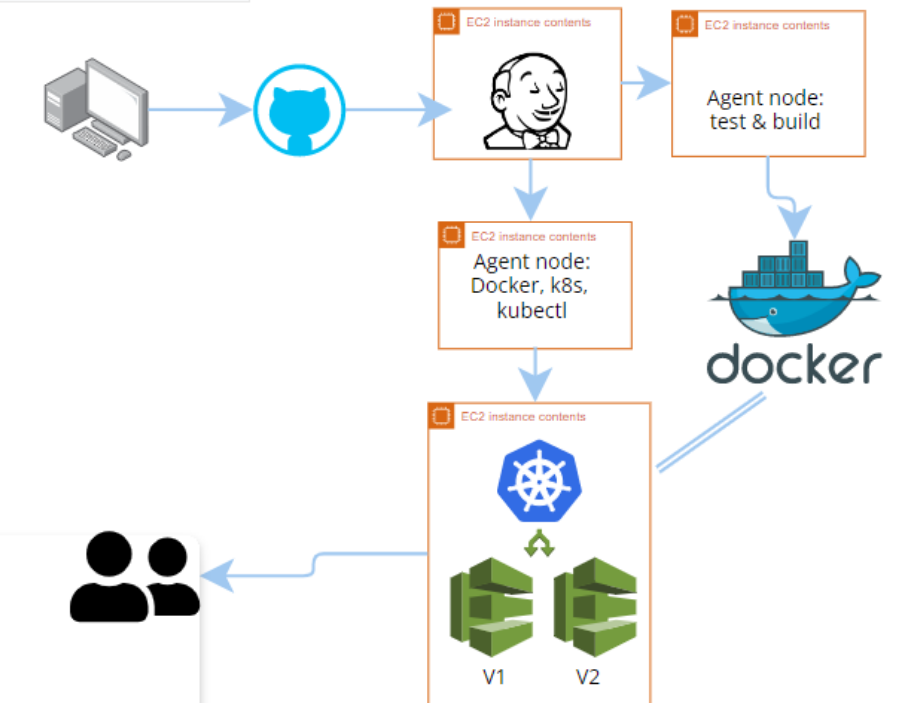
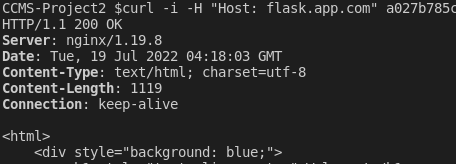
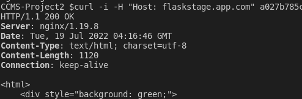

# CCMS Project 2

`CI/CD Pipeline` for a `Python (Flask)` web app.

- Stored in a `Docker Hub` registry & `GitHub` repository,
- Running on a `Docker (Kubernetes)` Network,
- Hosted by an `AWS EKS` cloud cluster and Integrated through `Jenkins`.
- Something `Jenkins`



## Continuous Integration

- `GitHub webhook` notifies `Jenkins` of a `push` to `main`.
- `Jenkins` then uses an `EC2 instance` agent for `testing` and `building`.
- If `unittests` pass, `docker image` is pushed to `Docker Hub`.

## Continuous Deployment

After a successful push to `Docker Hub`, `Jenkins` uses `SSH` to directs `Kubernetes` to update the `cluster`.

## Local Development

### Setup & Run:

```bash
docker build . -t ccms-project2-image

docker run -p 5000:5000 --rm --name ccms-project2-container ccms-project2-image

or

export FLASK_APP=app.py
export FLASK_ENV=development
flask run
```

<http://127.0.0.1:5000>

## AWS EKS

### Setup & Run:

```bash
eksctl create cluster --name p2 --version 1.19 --region us-east-2 --nodegroup-name standard-nodes --node-type t3.small --nodes 2 --managed --node-ami-family Ubuntu2004

kubectl apply -f kubernetes/nginx-ingress/nginx-ingress-controller.yaml
kubectl apply -f kubernetes/nginx-ingress/flask-deployment.yaml
kubectl apply -f kubernetes/nginx-ingress/flask-service.yaml
kubectl apply -f kubernetes/nginx-ingress/nginx-ingress.yaml

kubectl get svc --namespace=nginx-ingress
```
#### View Production (Blue)
```bash
curl -i -H "Host: flask.app.com" <cluster server url>
```


#### View Development (Green)
```bash
curl -i -H "Host: flaskstage.app.com" <cluster server url>
```

